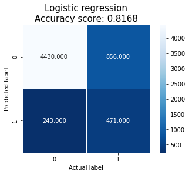
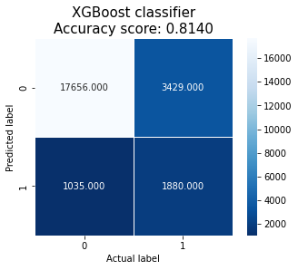

# Modeling

I first perform some data processing where I transform, scale and one-hot encode several features. Then, I train, validate and test a logistic regression model and a XGBoost classifier. I also do some basic work to address overfitting in the XGBoost classifier. I summarize the main results below and you can check all supporting work and comments in the notebook.

I believe it's important to mention that without a baseline level of performance it's difficult to assess whether a model is underfitting. Thus, we mainly focus on overfitting.

## Logistic regression

The training and validation accuracy of the logistic regression are 0.8224 and 0.8168, respectively, which suggests the model isn't overfitting the training data.

## XGBoost classifier

The training and validation accuracy of the XGBoost classifier are 0.8895 and 0.8127, respectively, which suggests the model is overfitting the training data.

We manually explore changes to some hyperparameters, observing that some of these changes are able to reduce overfitting. For example, reducing the maximum depth of a tree and shrinking the feature weights help reduce overfitting, bringing the training accuracy closer to the validation accuracy.

We also explore a k-fold cross-validation with the default implementation of the XGBoost classifier, finding that this process brings the accuracy (0.8140) closer to the initial validation accuracy (0.8127).

## Model comparison

The confusion matrices are shown below.

    <table>
	    <tr>
    	    <td style="padding:10px">
        	    
      	    </td>
            <td style="padding:10px">
            	
            </td>
        </tr>
    </table>

Some overall performance metrics are shown next.

| Model                     | Accuracy  | Precision | Recall    | F1 score  | Generalization error  |
| ---                       | ---       | ---       | ---       | ---       | ---                   |
| Logistic regression       | 0.8168    | 0.6597    | 0.3549    | 0.4615    | 0.1762                |
| Cross-validated XGBoost   | 0.8140    | 0.6449    | 0.3541    | 0.4572    | 0.1847                |

Comparing both models, we can conclude both models perform virtually the same. However, although the accuracy seems relatively high, the confusion matrices and their metrics tell us both models are rather poor. In particular, the recall scores tell us both models have a high number of false positives.
